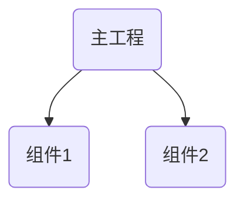

# 一、SPI（Service Provider Interface）

在介绍ServiceLoader之前，需要先说下SPI （Service Provider Interface）这个概念。

SPI属于动态加载接口实现类的的一项技术，是JDK内置的一种服务提供发现机制，使用ServiceLoader去加载接口对应的实现，这样我们就不用关注实现类，ServiceLoader会告诉我们。[官方文档](https://link.juejin.cn/?target=https%3A%2F%2Fdocs.oracle.com%2Fjavase%2Ftutorial%2Fsound%2FSPI-intro.html)描述为：为某个接口寻找服务的机制，类似IOC思想，将装配的控制权交给ServiceLoader。

**使用场景**

只提供服务接口，具体服务由其他组件实现，接口和具体实现分离（类似桥接），同时能够通过系统的ServiceLoader拿到这些实现类的集合，统一处理，这样在组件化中往往会带来很多便利，SPI机制可以**实现不同模块之间方便的面向接口编程**，拒绝了硬编码的方式，解耦效果很好。

例如有如下工程结构的项目：



场景：如果想在组件1中使用主工程或组件1使用组件2的方法或变量，如何实现

1. 常见方式，在组件1声明一些接口，由主工程实现。然后在初始化组件1的时候，通过注入方式传递给组件1。
2. ServiceLoader方式，如果都通过依赖注入的方式，组件间耦合较重。ServiceLoader方式也是组件1声明接口，主工程实现。但是无须注入，这部分工作由ServiceLoader自动实现。

# 二、使用方式

ServiceLoader的使用流程遵循：**服务约定 -> 服务实现 -> 服务注册 -> 服务发现/使用。**

首先约定几个概念名词，并且后文中，以这些名词行文。

概念说明备注服务接口或（通常是）抽象类出于加载的目的，**服务由单一类型表示，即单一接口或抽象类**。 （可以使用具体类，但不建议这样做。）服务提供者服务（接口和抽象类）的具体实现。服务提供者可以以扩展形式引入，例如jar包；也可以通过将它们添加到应用程序的类路径或通过其他一些特定于平台的方式来提供。给定服务提供者包含一个或多个具体类，这些类使用特定于提供者的数据和代码扩展该服务类型。   此工具强制执行的唯一要求是**提供程序类必须具有零参数构造函数**，以便它们可以在加载期间实例化。

1. 服务约定

   定义好接口或抽象类作为服务

2. 服务实现

   实现定义好的服务，由于ServiceLoader可以更方便不同组件间通信，高度解耦。所以更常见的场景是服务可能是定义在底层组件或引入jar包，在上层业务代码中具体实现。

3. 服务注册

   约定和实现了服务后，需要对服务进行注册，系统才能定位到该服务。注册方式是在java同级目录，创建一个**resources/META-INF/services**的目录，在该目录下，以服务的全限定名创建一个SPI描述文件。目录层级图如下：

   

   有了该文件，**即可将服务提供者(接口实现类)的全限定名分行写入该文件，即完成服务注册**。

   PS. 注册目录路径是固定，至于为什么后，下文代码部分将会说明。

示例：

```java

package com.example;
// 声明服务
public interface IHello {
    String sayHello();
}
---------------------------------------------------------------
// 实现服务
public class Hello implements IHello{
  @Override
  public String sayHello(){
    System.out.println("hello, world");
  }
}

---------------------------------------------------------------
// 使用服务
ServiceLoader<Hello> loader = ServiceLoader.load(IHello.class);
mIterator =loader.iterator(); 
while(mIterator.hasNext()){
    mIterator.next().sayHello();
}

```

# 三、代码逻辑

ServiceLoader成员变量说明

字段类型说明serviceClass*<*S*>*ServiceLoader加载的接口或抽象类loaderClassLoader类加载器providersLinkedHashMap*<*String,S*>*缓存加载的接口或抽象类（即service对象）lookupIteratorLazyIterator迭代器

## 3.1、ServiceLoader的创建

```java
    //ServiceLoader.class
    public static <S> ServiceLoader<S> load(Class<S> service,
                                            ClassLoader loader)
    {
        return new ServiceLoader<>(service, loader);
    }

    private ServiceLoader(Class<S> svc, ClassLoader cl) {
        service = Objects.requireNonNull(svc, "Service interface cannot be null");
        loader = (cl == null) ? ClassLoader.getSystemClassLoader() : cl;
        // Android-changed: Do not use legacy security code.
        // On Android, System.getSecurityManager() is always null.
        // acc = (System.getSecurityManager() != null) ? AccessController.getContext() : null;
        reload();
    }

    /**
     * Clear this loader's provider cache so that all providers will be
     * reloaded.
     *
     * <p> After invoking this method, subsequent invocations of the {@link
     * #iterator() iterator} method will lazily look up and instantiate
     * providers from scratch, just as is done by a newly-created loader.
     *
     * <p> This method is intended for use in situations in which new providers
     * can be installed into a running Java virtual machine.
     */
    public void reload() {
        providers.clear();
        lookupIterator = new LazyIterator(service, loader);
    }
```

可以看出ServiceLoader#load方法创建了ServiceLoader对象，并且初始化了service、loader对象（含义见上表）。同时调用了reload方法清空了缓存，并且创建了LazyIterator对象，用来遍历加载的服务。

**这个阶段发现只是做了初始化工作，但并没有加载注册的服务，所以这是一个懒加载过程**（LazyIterator的命名也透露了这点）。

## 3.2、服务的注册

3.1小节中说了*load*方法只是做了一些初始化的工作，并没有注册服务。那么服务具体是在什么位置进行注册的呢？在使用时，会获取ServiceLoader的迭代器来遍历服务，看下*ServiceLoader#iterator*方法：

```java
public Iterator<S> iterator() {
        return new Iterator<S>() {
            Iterator<Map.Entry<String,S>> knownProviders
                = providers.entrySet().iterator();

            public boolean hasNext() {
                if (knownProviders.hasNext())
                    return true;
                return lookupIterator.hasNext();
            }

            public S next() {
                if (knownProviders.hasNext())
                    return knownProviders.next().getValue();
                return lookupIterator.next();
            }

            public void remove() {
                throw new UnsupportedOperationException();
            }
        };
    }
```

可见就是创建了一个迭代器对象，实现了3个方法*hasNext*（用以判断是否还有为遍历的服务）、*next*（获取服务）和*remove*。在内部用*knownProviders*缓存了已注册服务，每次调用*hasNext或next*方法时，**先从缓存中的服务中取，没有再调用lookupIterator的对应方法**。

对于首次创建的情况，缓存中没有注册好的服务，如果调用*hasNext，*就会调用*lookupIterator.hasNext()*，代码如下

```java
private class LazyIterator implements Iterator<S> {
        Class<S> service;
        ClassLoader loader;
        Enumeration<URL> configs = null;
        Iterator<String> pending = null;
        String nextName = null;
        public boolean hasNext() {
            return hasNextService();
        }

        private boolean hasNextService() {
           if (nextName != null) {//①
               return true;
           }
           if (configs == null) {//②
               try {
                   String fullName = PREFIX + service.getName();//③
                   if (loader == null)
                       configs = ClassLoader.getSystemResources(fullName);//④
                   else
                       configs = loader.getResources(fullName);
               } catch (IOException x) {
                   fail(service, "Error locating configuration files", x);
               }
           }
          while ((pending == null) || !pending.hasNext()) {//⑤
               if (!configs.hasMoreElements()) {
                   return false;
               }
               pending = parse(service, configs.nextElement());//⑥
           }
           nextName = pending.next();
           return true;
       }
  
}
```

①：判断nextName是否为null，表示下一个待注册服务的全称（目录路径+服务名），不为null表示有服务，直接返回true；否则继续执行

②：*configs*保存所有指定名称的资源，在这里就是我们声明的**resources/META-INF/services/<package name>文件**。如果为null，表示还未加载该资源文件。

③：构造要加载的资源文件全名，*PREFIX*的值为：

```java
private static final String PREFIX = "META-INF/services/";
```

这就是为什么我们要创建**resources/META-INF/services目录，并在该目录声明一个注册文件。**

④：如果注册成功了，*configs*变量就储存了所有声明的服务全名。**这一步才是真正注册了所有服务的位置，懒加载就是在这里进行的。**

⑤：首次加载，*pending*迭代器对象为null，进入循环。如果*configs*里没有值，直接返回false，表明没有可注册的服务。否则进入⑥处

⑥：调用parse方法，它打开注册文件开始读取文件内容，每读到一行服务全名，如果它没有缓存过（即不在providers里）。就把它添加到一个列表中。直到文件内容全部读取完成，最后返回该列表的迭代器对象。

```java
private Iterator<String> parse(Class<?> service, URL u)
        throws ServiceConfigurationError
    {
        InputStream in = null;
        BufferedReader r = null;
        ArrayList<String> names = new ArrayList<>();
        try {
            in = u.openStream();
            r = new BufferedReader(new InputStreamReader(in, "utf-8"));
            int lc = 1;
            while ((lc = parseLine(service, u, r, lc, names)) >= 0);
        } catch (IOException x) {
            fail(service, "Error reading configuration file", x);
        } finally {
            try {
                if (r != null) r.close();
                if (in != null) in.close();
            } catch (IOException y) {
                fail(service, "Error closing configuration file", y);
            }
        }
        return names.iterator();
    }
    
private int parseLine(Class<?> service, URL u, BufferedReader r, int lc,
                          List<String> names)
        throws IOException, ServiceConfigurationError
    {
        String ln = r.readLine();
        if (ln == null) {
            return -1;
        }
        int ci = ln.indexOf('#');
        if (ci >= 0) ln = ln.substring(0, ci);
        ln = ln.trim();
        int n = ln.length();
        if (n != 0) {
            if ((ln.indexOf(' ') >= 0) || (ln.indexOf('\t') >= 0))
                fail(service, u, lc, "Illegal configuration-file syntax");
            int cp = ln.codePointAt(0);
            if (!Character.isJavaIdentifierStart(cp))
                fail(service, u, lc, "Illegal provider-class name: " + ln);
            for (int i = Character.charCount(cp); i < n; i += Character.charCount(cp)) {
                cp = ln.codePointAt(i);
                if (!Character.isJavaIdentifierPart(cp) && (cp != '.'))
                    fail(service, u, lc, "Illegal provider-class name: " + ln);
            }
            if (!providers.containsKey(ln) && !names.contains(ln))
                names.add(ln);
        }
        return lc + 1;
    }
```

## 3.3 服务的使用

通过3.2小节讲解的步骤，现在服务已经全部注册了，可以获取各个服务实例并使用了。通常是通过*next()*方法获取服务的实例对象，代码如下：

```java
        public S next() {
                return nextService();
        }

        private S nextService() {
            if (!hasNextService())// ①
                throw new NoSuchElementException();
            String cn = nextName;
            nextName = null;
            Class<?> c = null;
            try {
                c = Class.forName(cn, false, loader);//②
            } catch (ClassNotFoundException x) {
                fail(service,"Provider " + cn + " not found", x);
            }
            if (!service.isAssignableFrom(c)) {
                ClassCastException cce = new ClassCastException(service.getCanonicalName() + " is not assignable from " + c.getCanonicalName());
                fail(service,"Provider " + cn  + " not a subtype", cce);
            }
            try {
                S p = service.cast(c.newInstance());//③
                providers.put(cn, p);//④
                return p;
            } catch (Throwable x) {
                fail(service,"Provider " + cn + " could not be instantiated",x);
            }
            throw new Error();          // This cannot happen
        }
```

①：没有服务，直接抛出异常

②：根据服务的全限定名字加载其class对象。

③：调用newInstance创建服务的实例，并且将该实例类型装换成声明的服务类型（接口或抽象类）。

④：缓存一份，提升访问效率，避免每次都反射加载。

至此，就拿到了服务的实例，使用者就可以通过该实例对象去调用各种实例方法了。

# 4、总结

1、本文详细说明了SPI的概念和ServiceLoader的具体用法，其使用包括**服务约定 -> 服务实现 -> 服务注册 -> 服务发现/使用**等过程

2、通过代码分析，说明了ServiceLoader的底层实现，包括服务注册的懒加载机制、服务注册为什么固定目录以及服务使用时的*hasNext()*和*next()*方法等。