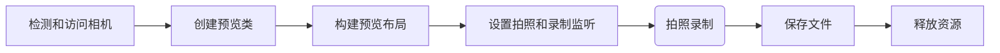
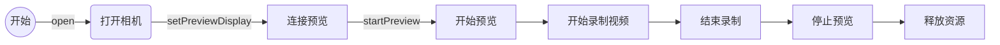

# 一、基础知识

Android提供了一套API用以进行自定义相机开发，包含控制和管理相机的Camera、Camera2以及最新的jetpack框架下的CameraX类，用以展示预览画面的SurfaceView，用以录制视频和拍照的MediaRecorder，用以获取视频缩略图的MediaMetadataRetriever和ThumbnailUtils等。自定义相机开发中涉及到的API如图所示。 

# 二、权限声明

在自定义相机开发过程中通常要使用到相机和录音权限，以及声明对该硬件功能的使用。注意在Android 6.0以上，申请权限使用动态权限申请。

```xml
//声明权限
<uses-permission android:name="android.permission.CAMERA" />
<uses-permission android:name="android.permission.RECORD_AUDIO" />
//相机功能
<uses-feature android:name="android.hardware.camera" />
//自动对焦功能
<uses-feature android:name="android.hardware.camera.autofocus" />
```

# 三、构建相机应用

自定义相机开发的一般步骤是



## 3.1 检测相机设备

主要设检测手机设备是否有相机（现在还有没带相机的手机？:joy:），检测方法使用

```java
/** Check if this device has a camera */
private boolean checkCameraHardware(Context context) {
    if (context.getPackageManager().hasSystemFeature(PackageManager.FEATURE_CAMERA)){
        // this device has a camera
        return true;
    } else {
        // no camera on this device
        return false;
    }
}
```

现在手机基本都有相机了，而且不止一个，我们可以获取相机数量，然后根据其Camera.Info对应的facing字段确定其朝向，用以获取前置相机或后置相机id。

```java
......
//获取相机数量
int numberOfCameras = Camera.getNumberOfCameras();
            if (numberOfCameras == 0) {
                LogUtils.d(TAG, "open camera failed.");
                return;
            }

            for (int i = 0; i < numberOfCameras; i++) {
                ......
                //创建CameraInfo对象
                Camera.CameraInfo info = new Camera.CameraInfo();
                //获取对应相机的信息
                Camera.getCameraInfo(i, info);
                //判断是前置还是后置相机，并赋值
                //INVALID_CAMERA_ID表示初始值，即未赋值前的相机id
                if (info.facing == Camera.CameraInfo.CAMERA_FACING_FRONT && mFrontCameraId == INVALID_CAMERA_ID) {
                    mFrontCameraId = i;
                } else if (info.facing == Camera.CameraInfo.CAMERA_FACING_BACK && mBackCameraId == INVALID_CAMERA_ID) {
                    mBackCameraId = i;
                }
            }
......
```

## 3.2 访问相机

获取到要开启的相机id后，调用open (int cameraId)方法打开指定id相机，该方法返回一个Camera对象

```java
/** A safe way to get an instance of the Camera object. */
public static Camera openCamera(int cameraId){
    Camera camera = null;
    try {
        camera = Camera.open(cameraId); // 获取相机实例
    }
    catch (Exception e){
        // Camera is not available 
        //相机被其他进程占用或不存在
    }
    return camera; // returns null if camera is unavailable
}
```

获取相机实例后，需要设置其参数（Camera.Parameters），该类主要用以设置相机功能，包含预览尺寸（格式、帧率等）、对焦模式、白平衡、画面缩放、闪光灯等重要功能。这些功能根据应用使用的具体场景去设置即可。其中，预览画面尺寸必须设置，同时要和预览空间尺寸比例相匹配，否则会出现画面拉升的问题。

<mark>注意：**任何预览、拍照、录像参数的设置都必须从系统支持的尺寸中选取**。</mark>例如，预览画面尺寸的设置不能随意指定，必须从系统支持的尺寸中选取。这点尤为重要，后续许多参数的设置都必须遵循这一准则。

## 3.3 预览

在以上步骤设置完毕后，创建预览控件，添加SurfaceHolder.Callback，用以监听预览视图的创建、改变和销毁情况。

<cite>以下是Google官方文档提供的示例代码</cite>

```java
/** A basic Camera preview class */
public class CameraPreview extends SurfaceView implements SurfaceHolder.Callback {
    private SurfaceHolder mHolder;
    private Camera mCamera;

    public CameraPreview(Context context, Camera camera) {
        super(context);
        mCamera = camera;
        // Install a SurfaceHolder.Callback so we get notified when the
        // underlying surface is created and destroyed.
        mHolder = getHolder();
        mHolder.addCallback(this);
        // deprecated setting, but required on Android versions prior to 3.0
        mHolder.setType(SurfaceHolder.SURFACE_TYPE_PUSH_BUFFERS);
    }

    public void surfaceCreated(SurfaceHolder holder) {
        // The Surface has been created, now tell the camera where to draw the preview.
        try {
            mCamera.setPreviewDisplay(holder);
            mCamera.startPreview();
        } catch (IOException e) {
            Log.d(TAG, "Error setting camera preview: " + e.getMessage());
        }
    }

    public void surfaceDestroyed(SurfaceHolder holder) {
        // empty. Take care of releasing the Camera preview in your activity.
    }

    public void surfaceChanged(SurfaceHolder holder, int format, int w, int h) {
        // If your preview can change or rotate, take care of those events here.
        // Make sure to stop the preview before resizing or reformatting it.

        if (mHolder.getSurface() == null){
          // preview surface does not exist
          return;
        }

        // stop preview before making changes
        try {
            mCamera.stopPreview();
        } catch (Exception e){
          // ignore: tried to stop a non-existent preview
        }

        // set preview size and make any resize, rotate or
        // reformatting changes here

        // start preview with new settings
        try {
            mCamera.setPreviewDisplay(mHolder);
            mCamera.startPreview();

        } catch (Exception e){
            Log.d(TAG, "Error starting camera preview: " + e.getMessage());
        }
    }
}
```

调用startPreview方法后，预览数据就会加载到预览控件，并渲染绘制出来。注意，在视图发送改变时，说先停止预览，再开启预览。

开启预览后，会发现预览画面颠倒，这是由于相机传感器方向和设备自然方向不一致导致的问题，通过获取相机信息Camera.Info中的**orientation**字段，然后调用**setDisplayOrientation**方法对预览画面旋转修正手机上展示的画面，达到所见即所得的效果。同理前置相机也需要进行响应适配。具体可见[Android音视频开发之基础知识](https://blog.csdn.net/qq_21830869/article/details/107732238)

## 3.4 拍照

打开相机预览后，便可以开始拍照，在代码中，为界面控件设置监听器，来获取拍照获取的图片数据。使用

takePicture (Camera.ShutterCallback shutter, Camera.PictureCallback raw, Camera.PictureCallback jpeg)方法拍照，然后通过Camera.PictureCallback获取捕获的图片数据。takePicture方法有3个参数，分别是：

- Camera.ShutterCallback：会在传感器捕获画面的瞬间调用，应用场景是用来播放拍照声音（咔嚓声）
- Camera.PictureCallback: 未经压缩的原始图片数据
- Camera.PictureCallback：jpeg图片数据

拍照方法调用时机：开启预览后（调用startPreview方法后），**且不能再录制中调用该方法**

在拍照回调中获取图片数据，通常在这里进行图片保存和其他处理的步骤，Google示例代码如下：

```java
private PictureCallback mPicture = new PictureCallback() {
    @Override
    public void onPictureTaken(byte[] data, Camera camera) {
      	//获取文件存储位置
        File pictureFile = getOutputMediaFile(MEDIA_TYPE_IMAGE);
        if (pictureFile == null){
            Log.d(TAG, "Error creating media file, check storage permissions");
            return;
        }
        try {
            //保存图片
            FileOutputStream fos = new FileOutputStream(pictureFile);
            fos.write(data);
            fos.close();
        } catch (FileNotFoundException e) {
            Log.d(TAG, "File not found: " + e.getMessage());
        } catch (IOException e) {
            Log.d(TAG, "Error accessing file: " + e.getMessage());
        }
    }
};
//设置好拍照监听后，调用拍照方法
mCamera.takePicture(null, null, picture);
```

## 3.5 录像

录像使用MediaRecorder（录制器）来专门实现，录像的实现流程。



在录制过程中，对于录制的管理可视为一个简单的状态机，通过调用相应方法实现状态的流转，从而达到控制整个录制过程的目的。借用Google官方描述状态流转的示意图。


### 3.5.1 MediaRecorder

该类是具体实现录制功能的API，在开始录制前，需要解除应用进程对相机资源的占用和设置一系列的录制参数，包括音视频源、输出格式、音视频编解码器，文件储存路径等。参数设定后，调用prepare方法准备好录制器，然后就可以调用start方法录制。MideaRecorder重要方法如下：


如图所示是使用MediaRecorder录制视频时的一些重要方法，方法前的序号表示其应该调用的顺序，注意在录制视频时，方法调用顺序和参数非常重要，如果顺序或参数错误或报异常，并且应用崩溃，常见有方法调用顺序或参数错误引起的异常有：

```tex
MediaRecorder: start failed: -19
MediaRecorder: start failed: -22
```

首先配置录制参数，注意设置的顺序，参数设置完后调用prepare方法准备好录制器。

```java
private boolean prepareVideoRecorder(){

    mCamera = getCameraInstance();
    mediaRecorder = new MediaRecorder();

    // Step 1: Unlock and set camera to MediaRecorder
    mCamera.unlock();
    mediaRecorder.setCamera(mCamera);

    // Step 2: Set sources
    mediaRecorder.setAudioSource(MediaRecorder.AudioSource.CAMCORDER);
    mediaRecorder.setVideoSource(MediaRecorder.VideoSource.CAMERA);

    // Step 3: Set a CamcorderProfile (requires API Level 8 or higher)
    mediaRecorder.setProfile(CamcorderProfile.get(CamcorderProfile.QUALITY_HIGH));

    // Step 4: Set output file
    mediaRecorder.setOutputFile(getOutputMediaFile(MEDIA_TYPE_VIDEO).toString());

    // Step 5: Set the preview output
    mediaRecorder.setPreviewDisplay(mPreview.getHolder().getSurface());

    // Step 6: Prepare configured MediaRecorder
    try {
        mediaRecorder.prepare();
    } catch (IllegalStateException e) {
        Log.d(TAG, "IllegalStateException preparing MediaRecorder: " + e.getMessage());
        releaseMediaRecorder();//释放录制器
        return false;
    } catch (IOException e) {
        Log.d(TAG, "IOException preparing MediaRecorder: " + e.getMessage());
        releaseMediaRecorder();
        return false;
    }
    return true;
}
```

### 3.5.2 lock和unlock方法

在设置录制参数时，注意到调用了unlock方法，查看源码中该方法说明：

<p>Unlocks the camera to allow another process to access it. Normally, the camera is locked to the process with an active Camera object until `release()` is called. To allow rapid handoff between processes, you can call this method to release the camera temporarily for another process to use; once the other process is done you can call `reconnect()` to reclaim the camera.</p>

大意为「解锁」相机允许其他进程获取相机，持有Camera实例的进程会一直「占有」相机直到调用了release方法。可以调用该方法短暂释放相机以供其他进程使用，其他进程使用完毕可以调用reconnect方法重新获取相机。

lock和unlock都是指让当前进程（Camera实例持有对象所在进程）「占有」或「解除」**相机硬件**。

在自定义相机过程中，涉及到的预览、拍照、录制等过程都是异步执行的，其中录制由专门的录制进程负责执行，而通常情况下，Camera实例的持有对象在我们的应用进程中，所以需要调用unlock方法释放”我们“的进程对相机资源的占用，从而允许让其他进程（录制进程）获取相机。

然后在录制完成后，调用lock方法使当前的应用进程重新获取相机。从 Android 4.0（API 级别 14）开始，系统将自动管理`Camera.lock()` 和 `Camera.unlock()` 调用，不需要在手动调用lock方法了，结束录制后当前进程自动获取对相机的占有。

### 3.5.3 视频录制

Google示例代码：

```java 
private boolean isRecording = false;

// Add a listener to the Capture button
Button captureButton = (Button) findViewById(id.button_capture);
captureButton.setOnClickListener(
    new View.OnClickListener() {
        @Override
        public void onClick(View v) {
            if (isRecording) {
                // stop recording and release camera
                mediaRecorder.stop();  // stop the recording
                releaseMediaRecorder(); // release the MediaRecorder object
                mCamera.lock();         // take camera access back from MediaRecorder

                // inform the user that recording has stopped
                setCaptureButtonText("Capture");
                isRecording = false;
            } else {
                // initialize video camera
                if (prepareVideoRecorder()) {
                    // Camera is available and unlocked, MediaRecorder is prepared,
                    // now you can start recording
                    mediaRecorder.start();

                    // inform the user that recording has started
                    setCaptureButtonText("Stop");
                    isRecording = true;
                } else {
                    // prepare didn't work, release the camera
                    releaseMediaRecorder();
                    // inform user
                }
            }
        }
    }
);
```

录制成功后，视频文件将保存在setOutputFile方法里设置的文件路径。相机是设备上所有应用的共享资源。应用可在获取 `Camera` 实例后使用相机；当应用暂停 (`Activity.onPause()`) 或停止使用相机时，必须极为小心地释放相机对象。如果应用没有妥善释放相机，则所有对相机的后续访问（包括本应用的访问），都将失败并且可能会导致本应用或其它应用关闭。

