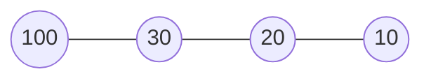
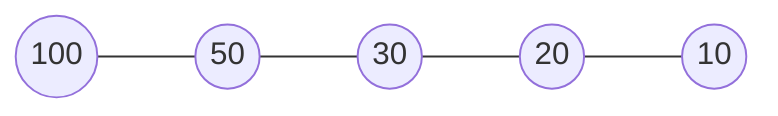

[TOC]

# 一、消息机制原理

Handler消息机制老生常谈了，必备八股之一。但是每次看都有新收获，故好好总结一下Handler相关知识。

## 1.1 基本概念

### 1、Handler

用于发送和处理消息的类，有多种重载的构造方法，通过一系列`sendXXX`和`postXXX`方法来发送消息到消息队列，然后通过实现`Handler.Callback`接口或重写`handleMessage`方法处理消息

### 2、MessageQueue

消息队列，它是一个链表结构，用以存放handler发送的消息，实现了获取消息的方法`next()`和移除消息及消息处理回调的方法（`removeXXX`系列方法)

### 3、Message

消息，承载一些基本数据，消息队列存放对象。维护了一个消息对象池，可以复用消息，避免创建太多消息对象占用过多内存，导致APP卡顿。

消息分类：


### 4、Looper

消息机制的灵魂，用以不断调度消息对象并且分发给handler处理。Looper是同线程绑定的，不同线程的Looper不一样，通过ThreadLocal实现线程隔离。

## 1.2 消息机制主流程

### 1、发送消息


可以使用sendMessage（以及一系列 sendXXX的消息发送方法）和post方法发送即时同步消息，或通过sendXXXDelayed和postDelayed发送延迟同步消息。

如果是通过sendXXX方法发送即时或延时消息，最终都会辗转调用到`sendMessageAtTime(@NonNull Message msg, long uptimeMillis)`方法，然后调用`enqueueMessage`方法。

```java
private boolean enqueueMessage(@NonNull MessageQueue queue, @NonNull Message msg,
            long uptimeMillis) {
        msg.target = this;// ① 设置处理该消息的handler对象
        msg.workSourceUid = ThreadLocalWorkSource.getUid();
		// ② 设置消息类型，同步或异步
        if (mAsynchronous) {
            msg.setAsynchronous(true);
        }
  	    // ③ 交由消息队列的入队方法
        return queue.enqueueMessage(msg, uptimeMillis);
    }
```

该方法主要有3个作用，注释中的①②③分别说明了。

### 2、消息入队

消息入队最终是靠消息队列的enqueueMessage方法完成，其代码如下

```java
boolean enqueueMessage(Message msg, long when) {
  		// ①
        if (msg.target == null) {
            throw new IllegalArgumentException("Message must have a target.");
        }
        if (msg.isInUse()) {
            throw new IllegalStateException(msg + " This message is already in use.");
        }

        synchronized (this) {
            if (mQuitting) {
                IllegalStateException e = new IllegalStateException(
                        msg.target + " sending message to a Handler on a dead thread");
                Log.w(TAG, e.getMessage(), e);
                msg.recycle();
                return false;
            }
			// ②
            msg.markInUse();
            msg.when = when;
            Message p = mMessages;
            boolean needWake;
          	// ③
            if (p == null || when == 0 || when < p.when) {
                // New head, wake up the event queue if blocked.
                msg.next = p;
                mMessages = msg;
                needWake = mBlocked;
            } else {
                // ④
                needWake = mBlocked && p.target == null && msg.isAsynchronous();
                Message prev;
                for (;;) {
                    prev = p;
                    p = p.next;
                    if (p == null || when < p.when) {
                        break;
                    }
                    if (needWake && p.isAsynchronous()) {
                        needWake = false;
                    }
                }
                msg.next = p; // invariant: p == prev.next
                prev.next = msg;
            }

			// ⑤
            if (needWake) {
                nativeWake(mPtr);
            }
        }
        return true;
    }
```

注释中标明了5个注意点，👇一一说明下：

① 消息对象必须指定`target`，也就是处理消息的handler对象；而且message对象的`flag`为`FLAG_IN_USE`。否则将抛出异常。

②设置消息对象标志`FLAG_IN_USE`和时间，创建唤醒字段，用于标记是否需要唤醒消息队列

③如果当前消息队列没有消息或要入队的消息`when`值小于对列头消息`when`值，则将新消息插入到链表头部。设置`needWeak`，它又由`mBlocked`变量决定，`mBlocked`的设置是在`next()`方法中，**简单来说消息队列仅有延时消息或为空队列时，`mBlocked`为`true`**

④不满足③的情况下，从消息链表头开始遍历，将新消息插入到第一个when值大于新消息when值的消息节点前方。

例如当前消息队里：100 - 30 -20 -10（数字表示消息的when值）



现要插入一个新消息50，那么插入后的队列情况是：




⑤是否需要唤醒，需要则调用native方法唤醒

总之，**入队方法就是让所有消息根据when的大小尽量有序排列，when越小则越位于消息链表头部**。

### 3、消息出队

Looper的`loop()`在一个死循环中不断获取消息，获取到消息就分发给handler处理，获取消息通过`MessageQueue#next()`方法，这个方法逻辑较多且都比较重要，下面会详细说明。

```java
 Message next() {
        ......
		// ①
        int pendingIdleHandlerCount = -1; // -1 only during first iteration
   		// ②
        int nextPollTimeoutMillis = 0;
        for (;;) {
            if (nextPollTimeoutMillis != 0) {
                Binder.flushPendingCommands();
            }
			// ③
            nativePollOnce(ptr, nextPollTimeoutMillis);

            synchronized (this) {
                // Try to retrieve the next message.  Return if found.
                final long now = SystemClock.uptimeMillis();
                Message prevMsg = null;
                Message msg = mMessages;
              	// ④
                if (msg != null && msg.target == null) {
                    // Stalled by a barrier.  Find the next asynchronous message in the queue.
                    do {
                        prevMsg = msg;
                        msg = msg.next;
                    } while (msg != null && !msg.isAsynchronous());
                }
              	// ⑤
                if (msg != null) {
                    if (now < msg.when) {
                        // Next message is not ready.  Set a timeout to wake up when it is ready.
                        nextPollTimeoutMillis = (int) Math.min(msg.when - now, Integer.MAX_VALUE);
                    } else {
                        // Got a message.
                        mBlocked = false;
                        if (prevMsg != null) {
                            prevMsg.next = msg.next;
                        } else {
                            mMessages = msg.next;
                        }
                        msg.next = null;
                        if (DEBUG) Log.v(TAG, "Returning message: " + msg);
                        msg.markInUse();
                        return msg;
                    }
                } else {
                    // No more messages.
                    nextPollTimeoutMillis = -1;
                }

                // Process the quit message now that all pending messages have been handled.
                if (mQuitting) {
                    dispose();
                    return null;
                }

                // If first time idle, then get the number of idlers to run.
                // Idle handles only run if the queue is empty or if the first message
                // in the queue (possibly a barrier) is due to be handled in the future.
              	// ⑥
                if (pendingIdleHandlerCount < 0
                        && (mMessages == null || now < mMessages.when)) {
                    pendingIdleHandlerCount = mIdleHandlers.size();
                }
                if (pendingIdleHandlerCount <= 0) {
                    // No idle handlers to run.  Loop and wait some more.
                    mBlocked = true;
                    continue;
                }

                if (mPendingIdleHandlers == null) {
                    mPendingIdleHandlers = new IdleHandler[Math.max(pendingIdleHandlerCount, 4)];
                }
                mPendingIdleHandlers = mIdleHandlers.toArray(mPendingIdleHandlers);
            }

            // Run the idle handlers.
            // We only ever reach this code block during the first iteration.
            for (int i = 0; i < pendingIdleHandlerCount; i++) {
                final IdleHandler idler = mPendingIdleHandlers[i];
                mPendingIdleHandlers[i] = null; // release the reference to the handler
                boolean keep = false;
                try {
                    keep = idler.queueIdle();
                } catch (Throwable t) {
                    Log.wtf(TAG, "IdleHandler threw exception", t);
                }

                if (!keep) {
                    synchronized (this) {
                        mIdleHandlers.remove(idler);
                    }
                }
            }
			// ⑦
            // Reset the idle handler count to 0 so we do not run them again.
            pendingIdleHandlerCount = 0;
            // While calling an idle handler, a new message could have been delivered
            // so go back and look again for a pending message without waiting.
            nextPollTimeoutMillis = 0;
        }
    }
```

① `pendingIdleHandlerCount`表示IdleHandler的数量。

② `nextPollTimeoutMillis`表示消息队列休眠的时间，是个阻塞方法。 -1表示无限阻塞，0表示不阻塞

③ 实现阻塞的native方法，可通过`nativeWake`方法唤醒

④ 针对**同步屏障机制的处理**，前文已经说了普通消息在入队前一定会设置`target`属性，唯独有种方式不会，即`postSyncBarrier`方法发出的同步屏障消息是不会设置`target`属性的，同步屏障相关内容后面会详细介绍，这里只要了解普通的同步消息不会走到这步即可。

⑤ 对于同步消息，从此步开始真正去获取消息对象。首先明确下代码里的几个对象含义：`mMessage`始终表示消息链表头部，`p`表示当前节点，`prevMsg`表示`p`节点的前一个节点。

- 对于即时消息，设置`mBlocked=false`，表示不阻塞。同步消息的`prevMsg`始终为null，所以从头结点开始遍历，获取当前节点并返回。

- 对于延时消息，计算延时时间，然后走到⑥，若`now < mMessages.when`表示还没到延时消息执行时间，然后会走到`if(pendingIdleHandlerCount <= 0）`中，设置`mBlocked=true`，然后开始下次循环，又走到③处，`nextPollTimeoutMillis`不等于0，于是阻塞。

⑥ 用于计算`IdleHandler`个数，初始化`IdleHandler`数组。`IdleHandler`是用于在消息队列空闲时处理一些任务，适用于一些不紧急非高优的任务，后面也会详细介绍。

⑦ 重置`pendingIdleHandlerCount`和`nextPollTimeoutMillis`

### 4、消息分发

前文说了Looper的`loop`方法不断获取消息并分发，分发的关键代码就是

```java
public static void loop() {
				......
        for (;;) {
          	// ①
            Message msg = queue.next(); // might block
            if (msg == null) {
                // No message indicates that the message queue is quitting.
                return;
            }

            // This must be in a local variable, in case a UI event sets the logger
          	//②
            final Printer logging = me.mLogging;
            if (logging != null) {
                logging.println(">>>>> Dispatching to " + msg.target + " " +
                        msg.callback + ": " + msg.what);
            }
            // Make sure the observer won't change while processing a transaction.
            final Observer observer = sObserver;
						......
            try {
              	// ③
                msg.target.dispatchMessage(msg);
                if (observer != null) {
                    observer.messageDispatched(token, msg);
                }
                dispatchEnd = needEndTime ? SystemClock.uptimeMillis() : 0;
            } catch (Exception exception) {
                if (observer != null) {
                    observer.dispatchingThrewException(token, msg, exception);
                }
                throw exception;
            } finally {
                ThreadLocalWorkSource.restore(origWorkSource);
                if (traceTag != 0) {
                    Trace.traceEnd(traceTag);
                }
            }
           	......
           	// ④
            msg.recycleUnchecked();
        }
    }
```

① 获取Looper对象，如果为空的话抛出异常。

② 可以通过`Looper#setMessageLogging`方法设置打印器，用来输出一些开发者需要的信息，通常在性能监控上需要获取这些信息来评估优化效果。

③ 分发消息给handler处理，`target`就是在消息入队时设置的handler对象。

④ 回收消息对象

步骤③将消息分发给了对应handler，看下`dispatchMessage`方法的实现

```java
public void dispatchMessage(@NonNull Message msg) {
        if (msg.callback != null) {
            handleCallback(msg);
        } else {
            if (mCallback != null) {
                if (mCallback.handleMessage(msg)) {
                    return;
                }
            }
            handleMessage(msg);
        }
    }
```

代码很清晰，首先如果设置`msg.callback`，就调用`handleCallback`方法。那么`msg.callback`在哪里设置的呢？找到赋值的地方，发现`post`和`postDelayed`方法

```java
public final boolean post(@NonNull Runnable r) {
       return  sendMessageDelayed(getPostMessage(r), 0);
    }
```

传入了`getPostMessage`方法，继续看该方法

```java
private static Message getPostMessage(Runnable r) {
        Message m = Message.obtain();
        m.callback = r;
        return m;
    }
```

现在明了了，正是这里设置了`msg.callback`，并且值就是post的参数，一个runnable对象。

看下`handleCallback`代码

```java
private static void handleCallback(Message message) {
        message.callback.run();
    }
```

其实就是执行了post传入的runnable参数的run方法。

如果不是通过post方式发送的消息，就会走到else逻辑里。首先判断是否实现了`Handler.Callback`接口，可在handler的构造函数传入，设置了则调用`Handler.Callback`接口的`handleMessage`方法。

否则调用`Handler`的`handleMessage`方法，它是一个空方法，需要开发者重写来实现业务逻辑。

总结：**消息的分发执行顺序就是`post#run`方法 -> `Handler.Callback.handlerMessage`方法 -> `Handler#handlerMessage`方法**

至此，Handler消息的发送、入队出队、以及分发执行的全流程就阐述完毕了，路径还是很清晰的。但是依然遗留了一些问题，比如同步屏障、IdleHandler等，所以我们继续（:dog:）。

# 二、同步屏障

我们知道无论是应用启动还是屏幕刷新都需要完整绘制整个页面内容，目前大多数手机的屏幕刷新率为60Hz，也就是耳熟能详的16ms刷新一次屏幕。那么问题来了，如果主线程的消息队列待执行的消息非常多，怎么能保证绘制页面的消息优先得到执行，来尽力保证不卡顿呢。

前文分析了整个消息传递处理机制，有一个可疑地方，就是在取消息时。2个疑点

- 消息的target属性为null
- 消息被设置为了异步消息

```java
				...... 								
				final long now = SystemClock.uptimeMillis();
                Message prevMsg = null;
                Message msg = mMessages;
              	// *
                if (msg != null && msg.target == null) {
                    do {
                        prevMsg = msg;
                        msg = msg.next;
                    } while (msg != null && !msg.isAsynchronous());
                }

                if (msg != null) {
                    if (now < msg.when) {
                        nextPollTimeoutMillis = (int) Math.min(msg.when - now, Integer.MAX_VALUE);
                    } else {
                      	......
                        return msg;
                    }
                } else {
                    // No more messages.
                    nextPollTimeoutMillis = -1;
                }
```

在标*处，有个循环不断过滤掉同步消息，发现进入条件是target对象为null，而正常情况下入队的消息都会设置target。

从应用启动入手，页面启动过程不详述了，大体调用链路是`ViewRootImpl#setView` -> `ViewRootImpl#requestLayout` -> `ViewRootImpl#scheduleTraversals`

看下scheduleTraversals方法代码

```java
 void scheduleTraversals() {
        if (!mTraversalScheduled) {
            mTraversalScheduled = true;
          	// ①
            mTraversalBarrier = mHandler.getLooper().getQueue().postSyncBarrier();
            mChoreographer.postCallback(
                    Choreographer.CALLBACK_TRAVERSAL, mTraversalRunnable, null);
            if (!mUnbufferedInputDispatch) {
                scheduleConsumeBatchedInput();
            }
            notifyRendererOfFramePending();
            pokeDrawLockIfNeeded();
        }
    }
```

调用了消息队列的`postSyncBarrier`方法，进去看看

```java
		/**
		* @hide  
		*/
		public int postSyncBarrier() {
        return postSyncBarrier(SystemClock.uptimeMillis());
    }

    private int postSyncBarrier(long when) {
        // Enqueue a new sync barrier token.
        // We don't need to wake the queue because the purpose of a barrier is to stall it.
        synchronized (this) {
            final int token = mNextBarrierToken++;
          	//①
            final Message msg = Message.obtain();
            msg.markInUse();
            msg.when = when;
            msg.arg1 = token;

            Message prev = null;
            Message p = mMessages;
          	// ②
            if (when != 0) {
                while (p != null && p.when <= when) {
                    prev = p;
                    p = p.next;
                }
            }
            if (prev != null) { // invariant: p == prev.next
                msg.next = p;
                prev.next = msg;
            } else {
                msg.next = p;
                mMessages = msg;
            }
            return token;
        }
    }
```

① 发现创建了Message对象，但没有设置target属性。通过前面对handler的分析知道，loop方法分发给handler执行完后会回收message对象，即` msg.recycleUnchecked();`，它会将message对象的所有属性置空。

② 这一步跟普通的消息入队目的一样，就是把这个同步屏障消息按照when值大小插入到链表，when越大越靠近链表尾部。由于同步屏障消息设置的when是系统启动以来的时间，非常长，所以一般来说同步屏障消息基本都插入在尾部。

**第一个问题什么消息的target是null，那就是postSyncBarrier发送的同步屏障消息**

设置同步屏障后代码继续执行，执行 `mChoreographer.postCallback( Choreographer.CALLBACK_TRAVERSAL, mTraversalRunnable, null);`

一直深入postCallback查看，发现执行到了`postCallbackDelayedInternal`方法

```java
private void postCallbackDelayedInternal(int callbackType,
            Object action, Object token, long delayMillis) {
       	......	

        synchronized (mLock) {
            final long now = SystemClock.uptimeMillis();
            final long dueTime = now + delayMillis;
            mCallbackQueues[callbackType].addCallbackLocked(dueTime, action, token);

            if (dueTime <= now) {
                scheduleFrameLocked(now);
            } else {
              	// *
                Message msg = mHandler.obtainMessage(MSG_DO_SCHEDULE_CALLBACK, action);
                msg.arg1 = callbackType;
                msg.setAsynchronous(true);
                mHandler.sendMessageAtTime(msg, dueTime);
            }
        }
    }
```

*：**创建了真正绘制页面的消息对象，并且调用`setAsynchronous()`将消息设置为了异步**

所以第二个问题什么时候设置消息为异步也知道了。

总结：**对于异步消息，Looper会遍历消息队列找到异步消息执行，确保像刷新屏幕等高优任务及时得到执行。同步消息得不到处理，这就是为什么叫同步屏障的原因。当使用了同步屏障，记得通过`removeSyncBarrier`移除，不然同步消息不能正常执行。**

**当然，正常情况开发者也不能手动发送和移除同步屏障，因为它们都被hide注释了。不过了解这一机制和其中蕴含的编程思维还是很有裨益的**

# 三、IdleHandler

IdleHandler提供了一种在消息队列空闲时执行的某些操作的手段，适用于执行一些不重要且低优先级的任务。它的使用也很简单调用`MessageQueue#addIdleHandler`方法将任务添加到消息队列，然后队列空闲时会自动执行，可通过`removeIdleHandler`方法或自动回收。

消息队列通过一个ArrayList来储存添加的IdleHandler任务。

```java
private final ArrayList<IdleHandler> mIdleHandlers = new ArrayList<IdleHandler>();
// 临时储存IdleHandler任务
private IdleHandler[] mPendingIdleHandlers;
```

调用IdleHandler任务的位置在`MessageQueue#next()`方法中，无关代码已省略

```java
Message next() {
				// ①
        int pendingIdleHandlerCount = -1; // -1 only during first iteration
        int nextPollTimeoutMillis = 0;
        for (;;) {
           	......
            synchronized (this) {
              	// 省略部分为获取消息对象的过程
                .....
                  
                // If first time idle, then get the number of idlers to run.
                // Idle handles only run if the queue is empty or if the first message
                // in the queue (possibly a barrier) is due to be handled in the future.
                // ②
                if (pendingIdleHandlerCount < 0
                        && (mMessages == null || now < mMessages.when)) {
                    pendingIdleHandlerCount = mIdleHandlers.size();
                }
                if (pendingIdleHandlerCount <= 0) {
                    // No idle handlers to run.  Loop and wait some more.
                    mBlocked = true;
                    continue;
                }
				//③
                if (mPendingIdleHandlers == null) {
                    mPendingIdleHandlers = new IdleHandler[Math.max(pendingIdleHandlerCount, 4)];
                }
                mPendingIdleHandlers = mIdleHandlers.toArray(mPendingIdleHandlers);
            }

            // Run the idle handlers.
            // We only ever reach this code block during the first iteration.
          	// ④
            for (int i = 0; i < pendingIdleHandlerCount; i++) {
                final IdleHandler idler = mPendingIdleHandlers[i];
                mPendingIdleHandlers[i] = null; // release the reference to the handler

                boolean keep = false;
                try {
                    keep = idler.queueIdle();
                } catch (Throwable t) {
                    Log.wtf(TAG, "IdleHandler threw exception", t);
                }

                if (!keep) {
                    synchronized (this) {
                        mIdleHandlers.remove(idler);
                    }
                }
            }
			// ⑤
            // Reset the idle handler count to 0 so we do not run them again.
            pendingIdleHandlerCount = 0;

            // While calling an idle handler, a new message could have been delivered
            // so go back and look again for a pending message without waiting.
            nextPollTimeoutMillis = 0;
        }
    }
```

① 每次Looper调用`next`方法时，先将IdleHandler临时数组的大小`pendingIdleHandlerCount`重置为 -1。

② 首次运行时`pendingIdleHandlerCount < 0`肯定成立，如果当前消息队列为空或者只有延时消息时，认为此时队列空闲可以执行IdleHandler任务了。令`pendingIdleHandlerCount`为已添加的IdleHandler任务个数。

③ `mPendingIdleHandlers`是一个数组，首次执行时可定为空，所以初始化数组，数组大小最小为4。并且将`mIdleHandlers`列表中的任务复制到这个临时数组。

④ 循环临时数组执行IdleHandler任务，任务从`mPendingIdleHandlers`数组中取出后，会置空，释放对handler对象的引用。然后调用`queueIdle()`真正执行IdleHandler任务。

`queueIdle()`是一个接口方法，需要自己实现业务逻辑。另外它的返回值决定是否要自动删除该IdleHandler任务，返回true该任务执行后将不会被删除

⑤ 重置`mPendingIdleHandlers = 0`，开启下次循环。

# 四、消息对象池

消息是数据的载体，我们知道创建消息对象是一般不提倡去`new`一个对象，而是调用Message的一系列`obtain`的重载方法，原因就是因为可以复用已创建的Message对象，避免创建过多对象占据大量内存。既然是复用，那么一定存在某种数据结构去保存对象，这就是消息对象池，使用的是链表结构。

## 3.1 创建Message对象

消息对象池有几个重要属性，分别是：

```java
	 // 同步对象
	public static final Object sPoolSync = new Object();
	// 链表头节点
    private static Message sPool;
		// 消息池大小（链表长度，表示消息个数）
    private static int sPoolSize = 0;
		// 消息池最大容量
    private static final int MAX_POOL_SIZE = 50;
```

看下`obtain`方法

```java
public static Message obtain() {
        synchronized (sPoolSync) {
            if (sPool != null) {
                Message m = sPool;
                sPool = m.next;
                m.next = null;
                m.flags = 0; // clear in-use flag
                sPoolSize--;
                return m;
            }
        }
        return new Message();
    }
```

代码很简洁，获取消息对象是同步操作，从头节点开始，如果头结点不为空，取得头结点。然后指针后移，并且消息池大小减1。否则的才通过`new`方式创建新对象。

## 3.2 回收Message对象

可以调用`recycle`方法回收消息对象

```java
public void recycle() {
        if (isInUse()) {
            if (gCheckRecycle) {
                throw new IllegalStateException("This message cannot be recycled because it "+ "is still in use.");
            }
            return;
        }
        recycleUnchecked();
    }
```

如果消息标记了`FLAG_IN_USE`标志，不可回收。然后真正回收的方法是`recycleUnchecked();`

```java
void recycleUnchecked() {
        // Mark the message as in use while it remains in the recycled object pool.
        // Clear out all other details.
        flags = FLAG_IN_USE;
        what = 0;
        arg1 = 0;
        arg2 = 0;
        obj = null;
        replyTo = null;
        sendingUid = UID_NONE;
        workSourceUid = UID_NONE;
        when = 0;
        target = null;
        callback = null;
        data = null;

        synchronized (sPoolSync) {
            if (sPoolSize < MAX_POOL_SIZE) {
                next = sPool;
                sPool = this;
                sPoolSize++;
            }
        }
    }
```

可见回收消息，首先就是将其成员变量全部重置为初始值，然后在消息池大小不超过限制容量时，让将要被回收节点的`next`指向头结点，再把头指针移到当前节点，容量加1。

# 五、总结

本文从Handler消息机制出发，分析了消息从发送、调度和分发处理的全过程。在此过程中，发现涉及到了同步屏障、IdleHandler等知识点，并对其做了分析和说明。有些东西可能在平时开发中用不上，例如消息屏障，但其蕴含的编程思想也是十分值得学习借鉴的。